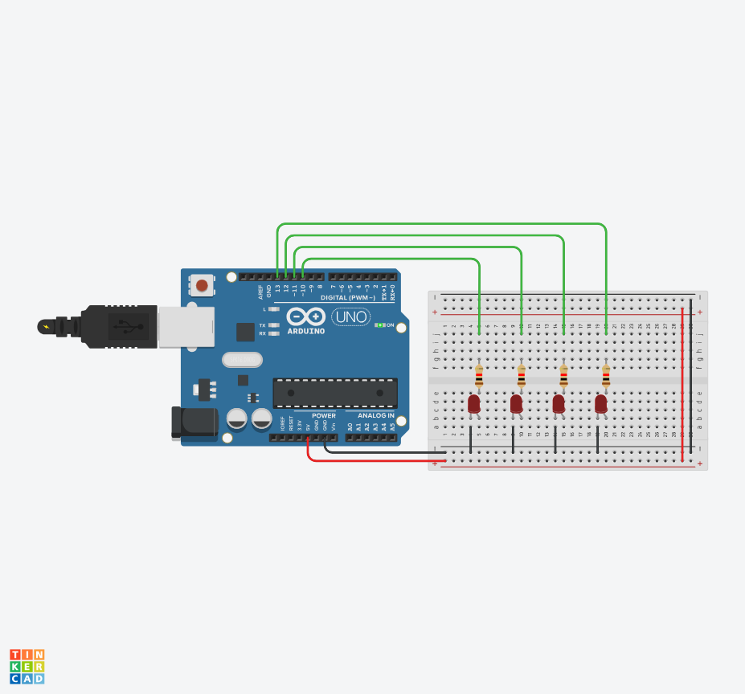
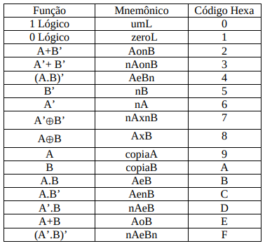

# AC2_EP04 - ULA de 4 bits em Arduino + Conversor PC → .hex

## Autores / Contato

* Bruna Furtado da Fonseca - [cestpassion](https://github.com/cestpassion)
* Gustavo Henrique Rodrigues De Castro - [GhrCastro](https://github.com/GhrCastro)

## Projeto do Arduino

## Descrição curta

Implementação de uma ULA (ALU) de 4 bits simulada em um Arduino que recebe um programa através da porta serial, armazena esse programa em um vetor de memória (100 posições) e o executa instrução a instrução mostrando o resultado em 4 LEDs. Além disso, um programa no PC converte um arquivo-fonte em mnemônicos (`testeula.ula`) para o formato `.hex` aceito pelo Arduino (cada instrução = 3 dígitos hex). 

---

## Objetivos do trabalho

* Construir o interpretador/execução da ULA no Arduino.
* Implementar o carregador de programa via serial.
* Fazer o conversor PC (`testeula.ula` → `testeula.hex`) que gera as instruções no formato exigido.
* Durante execução, imprimir o DUMP da memória e exibir W (4 bits) em 4 LEDs.
* Documentar e testar com todos os mnemônicos/instruções.

---

## Componentes do projeto / arquivos

...

---

## Arquitetura / Convenções principais

### Memória

...

### Formato de instrução

...

### LEDs — mapeamento de bits

...

---

## Tabela de instruções (S hex → operação)

---

## Como executar — Arduino

### Requisitos

...

### Passos

...

### Saída (Serial)

...

---

## Como executar — Conversor no PC

### Objetivo

...

### Entrada (exemplo de `testeula.ula`)

...

### Saída (`testeula.hex`)

...

### Execução

...

## Critérios de avaliação (checklist para apresentação)

* [ ] Código Arduino com comentários claros e organização.
* [ ] Conversor no PC (com muitos comentários).
* [ ] Arquivo `testeula.ula` de teste + `testeula.hex` gerado.
* [ ] Demonstração ao vivo:

  * carregar `.hex` no Arduino,
  * executar instrução a instrução,
  * mostrar DUMP da memória,
  * mostrar LEDs mudando conforme W.
* [ ] Programa de teste que cobre todas as instruções.
* [ ] Documento (README) explicando como rodar e o funcionamento.

